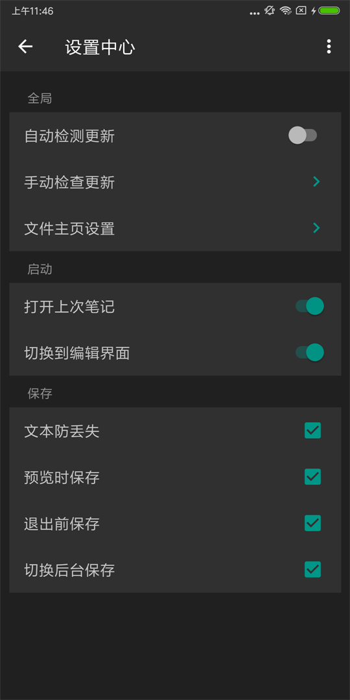

# M 笔记（Markdown手机版）

> M 笔记是一款功能强大的MarkDown编辑器，通过指定的算法，将文本内容转成网页代码，通过解析生成的HTML文件进行预览，也可供您在没有Markdown编辑器的设备上进行浏览。

> Markdown 是一种可以使用普通文本编辑器编写的标记语言，语法简洁明了、学习容易，而且功能比纯文本更强。通过简单的标记语法，它可以使普通文本内容具有一定图文混排格式的排版。因此有很多人用它写博客，写笔记。世界上流行的几大博客平台都能很好的支持Markdown。也越来越多的论坛，社区开始使用 Markdown 代替传统的文本编辑方式。

> 希望图文混排，又不希望太繁琐的操作。

> 希望写作时专注于内容，不希望大量的格式编辑打断思路。

> 已经了解 Markdown，但是还没有找到一款衬手的编辑器，为什么不试用下呢？

> 软件特色：

* 全屏编辑，全屏预览

* 多种预览样式选择

* 支持外接键盘快捷键

* Material Design界面风格

* 支持从其他文件管理器打开

* 支持编辑笔记时进行撤销重做

* 支持跳转链接，笔记之间的跳转

* 支持进行长短截图和第三方分享

* 支持多种格式解析(md、txt、html、htm)

* 自编式MarkDown语法，强大的兼容性优势

* 以文件作为笔记没有局限性，全新的设计理念

#### 发布渠道

* 酷安

* 应用宝

* 谷歌应用市场

* 小米应用市场

* 百度手机助手

[最新安装包下载地址](https://raw.githubusercontent.com/getActivity/Markdown/master/app.apk)

#### 截图欣赏

[点此查看MarkDown语法示例](Markdown.md)

